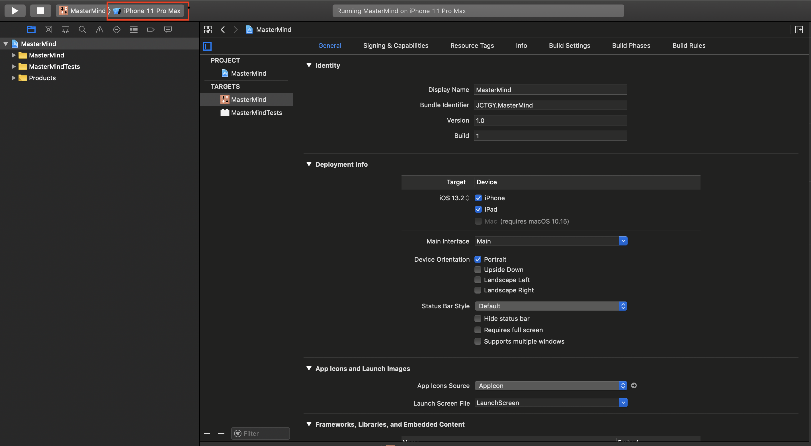

# Mastermind
Mastermind game: a code breaking game in iOS app


## Objective
Implement a mastermind game, which can be played by a user who tries to guess the number combinations. On each attempt to guess the numbers of combinations, the program will provide feedback whether the player had guess a number correctly, or/and  a number and order correctly. A player must guess the right number combinations with limit attempts and limit time to win the game.

## Structure

- Model
  * MasterMindManager: Manager that manage the game data
  * ScoreCalulate: responsible for handling score calculation
  * GameSound: disable/enable the sound
  * GameStat: store the useful game stats
  * RandomIntAPI: fetching random key from [random.org](www.random.org)
- View
 * mainstoryboard that have four views and two pop up views
- Controller
 * StartViewController: Entry point of the game can direct to Normal/Hard Game Mode
 * BaseGameViewContrloller: super class for both game mode ViewController class, contain the logic of moving selected buttons
 * NormalGameViewController: Normal game mode that inheritance from BaseGameViewContrloller have control for the table of buttons and pins
 * HardGameViewController: Same as NormalGameViewController, but is for hard game mode
 * RuleViewController: Display the rule of the game, can be accesses from StartViewController/PausePopUpViewController
 * PausePopUpViewController: pop up view that can pase the game and change some game setting
 * FinalPopUpViewController: End of the current game. Can press continue/end game
 
## Features    
* [How to play](#How-to-play)
* [Color/Animation](#coloranimation)
* [Normal/Hard Mode](#normalhard-mode)
* [Sounds](#Sounds)
* [Scores](#Scores)
* [Timer](#Timer)

## Requirements

- iOS 10.14.6+
- Xcode 11.3.1+

## Installation
```
cd ~
git clone https://github.com/JCTGY/MasterMind
cd MasterMind
open MasterMind.xcodeproj
```
Run the project by clicking play with desired iOS device 


### How to play

### Color/Animation

### Normal/Hard Mode
### Sounds
### Scores
### Timer
